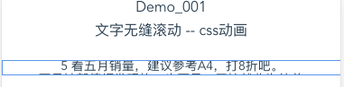
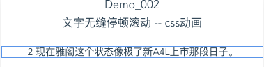
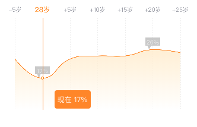

# my-demo

## Project setup
```
npm install
```

### Compiles and hot-reloads for development
```
npm run serve
```

### Compiles and minifies for production
```
npm run build
```

### Run your tests
```
npm run test
```

### Lints and fixes files
```
npm run lint
```

### Customize configuration
See [Configuration Reference](https://cli.vuejs.org/config/).


### githup
### ...or create a new repoitory on the command line
```
echo "# vue-cli3-demo" >> README.md
git init
git add README.md
git commit -m "first commit"
git remote add origin https://githup.com/kitty513624/vue-cli3-demo.git
git push -u origin master
```
### ...or push an existing repository from the command line
```
git remote add origin https://githup.com/kitty513624/vue-cli3-demo.git
git push -u origin master
```
### 文件说明：
##### Demo_001: vue-cli3中 文字无缝向上滚动
```
npm run serve
访问路径：http://localhost:8080/demo_001
```

```
npm run serve
访问路径：http://localhost:8080/demo_002
```
##### Demo_002: vue-cli3中 文字无缝停顿向上滚动

##### Demo_003: vue-cli3中 图片轮播组件
```
npm run serve
访问路径：http://localhost:8080/demo_003
```

##### Demo_004: vue-cli3中 Echarts图表折线图
```
npm run serve
访问路径：http://localhost:8080/demo_004
```

##### Demo_005: vue-cli3中 Echarts图表折线图分两段显示
```
npm run serve
访问路径：http://localhost:8080/demo_005
```

##### Demo_006: vue-cli3中 左右手势滑动显示图片
```
npm run serve
访问路径：http://localhost:8080/demo_006
```

